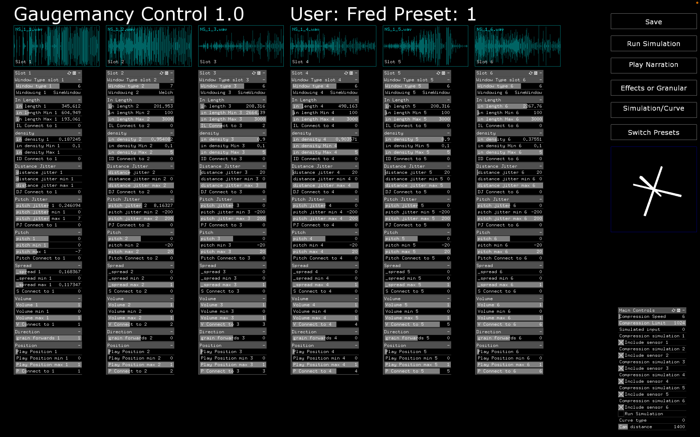
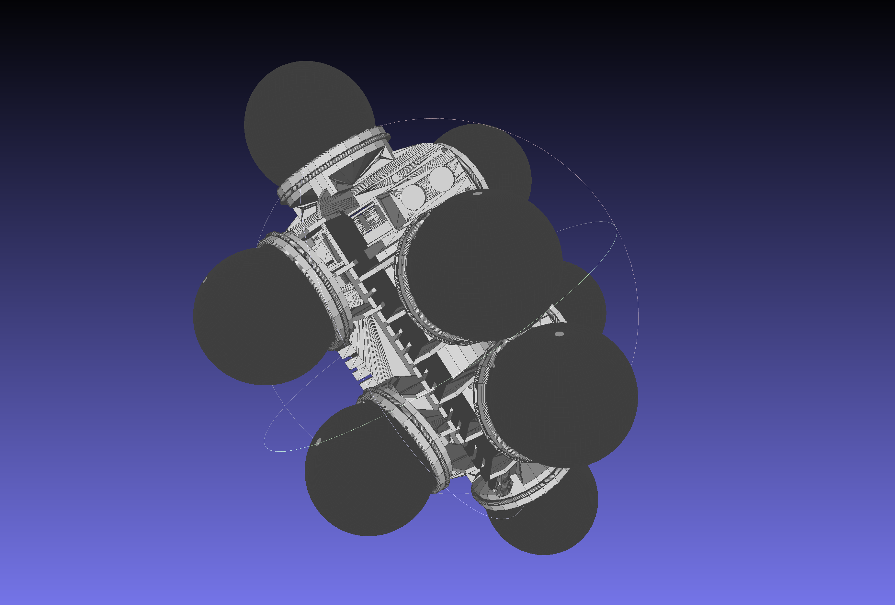

# Gaugemancy

### About

This is a pretty messy project for a RPI based mulit-channel granular synthesis instrument.

It comprises of a hardware instrument (that is a pain to maintain), that uses mini footballs attached to pressure sensors as a configurable interface for making music type noises.

The same software when compiled for OSX or Windows (and likely linux, but I have not tried), acts as a progamming tool for the hardware instrument.

This was all developed for a collaboration with choreographer Ali Moini for the project Gaugemancy: https://latitudescontemporaines.com/en/latitudes-prod/gaugemancy/ along with the amazing Pouya Ehsaei https://www.pouyaehsaei.com/

### Do not use this 

* The code is bad. 
* It doesnt make sense. 
* Without the hardware it is strange but maybe fun 
* That's it. 

### If you must:

This is made with https://github.com/openframeworks and uses several addons outside of the OF core:

https://github.com/npisanti/ofxAudioFile
https://github.com/memo/ofxMSAInteractiveObject
https://github.com/danomatika/ofxMidi
https://github.com/npisanti/ofxPDSP

