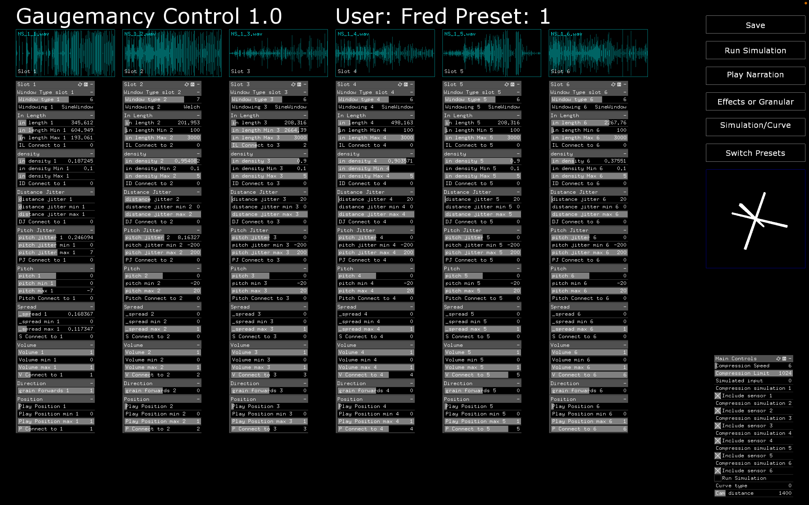
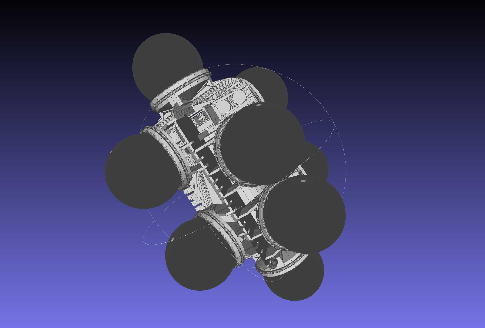

# Gaugemancy

### About

This is a pretty messy project for a RPI based mulit-channel granular synthesis instrument.

It comprises of a hardware instrument (that is a pain to maintain), that uses mini footballs attached to pressure sensors as a configurable interface for making music type noises.

The same software when compiled for OSX or Windows (and likely linux, but I have not tried), acts as a progamming tool for the hardware instrument.

This was all developed for a collaboration with choreographer Ali Moini for the project Gaugemancy: https://latitudescontemporaines.com/en/latitudes-prod/gaugemancy/ along with the amazing Pouya Ehsaei https://www.pouyaehsaei.com/

### Do not use this 

* The code is bad. 
* It doesnt make sense. 
* Without the hardware it is strange but maybe fun 
* That's it. 

### If you must:

This is made with https://github.com/openframeworks and uses several addons outside of the OF core:

https://github.com/npisanti/ofxAudioFile
https://openframeworks.cc/documentation/ofxGui/ (ships with OF core)
https://github.com/memo/ofxMSAInteractiveObject
https://github.com/danomatika/ofxMidi
https://openframeworks.cc/documentation/ofxOsc/ (ships with OF core)
https://github.com/npisanti/ofxPDSP

The Raspberry Pi build additionally needs `ofxGPIO` (for the pressure-sensor
ADC, the accelerometer, and the button/LED/relay GPIO pins) -- everything
guarded by `#ifdef HAS_ADC` in `src/ofApp.h`/`src/ofApp.cpp`, and the whole
of `src/PiHardware.h`.

### Building

IDE project files (`Gaugemancy.xcodeproj/`, `.vscode/`) aren't tracked here
-- they're generated, not source. To get one:

1. Create `addons.make` at the project root listing the addons above (one
   per line; add `ofxGPIO` for a Pi build).
2. Run openFrameworks' Project Generator (or the `projectGenerator` CLI) on
   this folder to generate an Xcode/VSCode/etc. project from it.
3. Or skip the IDE entirely and just run `make Release` (or `make Debug`)
   from this directory -- that's all the Pi build ever uses.

The Pi deployment additionally uses `ecosystem.config.js` (a PM2 process
config that runs the built binary as a restart-on-boot service) -- that one
*is* tracked, since it's not IDE-generated.

